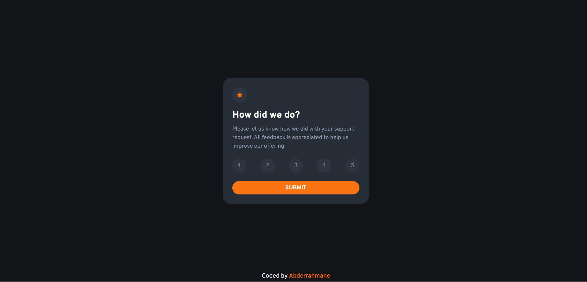
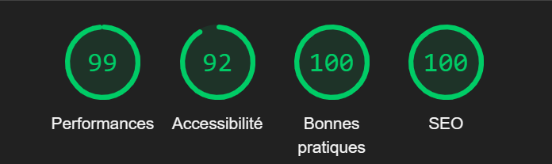

 # Frontend Mentor - Interactive rating component solution

This is a solution to the [Interactive rating component challenge on Frontend Mentor](https://www.frontendmentor.io/challenges/interactive-rating-component-koxpeBUmI). Frontend Mentor challenges help you improve your coding skills by building realistic projects. 

## Table of contents

  - [Overview](#overview)
  - [The challenge](#the-challenge)
  - [Screenshot](#screenshot)
  -[lighthouse-score](#lighthouse-score)
  - [Built with](#built-with)
  - [forContact](#for-contact)
 

 
## Overview

### The challenge 👨‍💻

Users should be able to:

- View the optimal layout for the app depending on their device's screen size
- See hover states for all interactive elements on the page
- Select and submit a number rating
- See the "Thank you" card state after submitting a rating

### Screenshot 

 
 ### Lighthouse score 🚀 
 

### Built with

- HTML5
- CSS3
- JS
 

 ## for contact 👋

- LinkedIn - [Abderrahmane Guerinik](https://www.linkedin.com/in/abderrahmane-guerinik-760847279/)
- Frontend Mentor - [@AbderrahmaneGuerinik](https://www.frontendmentor.io/profile/AbderrahmaneGuerinik)
 

